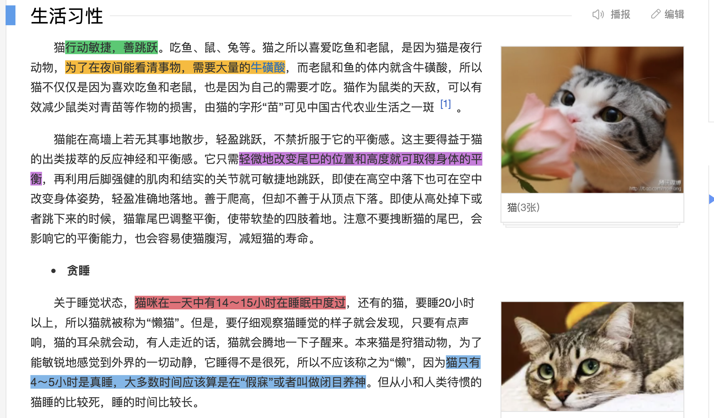

# <center> MyNote

<div align=center>

</div>

## 介绍

Microsoft Edge 浏览器开拓者大赛参赛项目。

团队名：请为您的队伍去个名吧

还在为记笔记发愁吗？还在为网页与笔记软件的频繁切换而烦恼吗？还在为笔记太多又疏于整理而糟心吗？

现在，来试试这款浏览器扩展吧！

## 已完成部分

- [x] Popup页面
- [x] Content页面
- [x] Light / Dark模式
- [x] 笔记自动保存
- [x] markdown解析
- [x] 添加/删除笔记
- [x] 页面标注
- [x] 笔记导出

## 使用方法

终端运行
```
npm install
npm run build
```
然后将生成的dist目录添加到浏览器扩展中

## 预览图

### light模式

收藏夹 \


写笔记


### dark模式

收藏夹 \


写笔记


### 页面标注



## 代码结构


